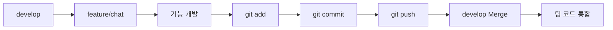

<div align="center">

#  Sin Seung Min

### Backend Developer

**Java · Spring Boot 기반의 백엔드 개발자를 준비하고 있습니다.**

사용자에게 필요한 기능을 고민하고,
데이터베이스부터 백엔드 로직, 실시간 통신까지 직접 구현해보며 성장하고 있습니다.

</div>

---

## About Me

* 동서대학교 소프트웨어융합대학 정보통신공학전공
* Java / Spring Boot 기반 백엔드 개발 학습
* Oracle 기반 DB 설계 및 데이터 처리 경험
* Git / GitHub를 활용한 팀 프로젝트 협업 경험
* WebSocket(STOMP) 기반 실시간 통신 구현 경험
* Gemini를 활용한 AI 회의 요약 기능 구현 경험

---

## 🛠 Tech Stack

### Language


### Backend


### Database


### Frontend


### Collaboration & Tools


---

# Main Projects

## 🐙 WorkTopus

### 실시간 협업 및 AI 회의록 자동화 플랫폼

> **담당 영역 : 실시간 채팅 시스템 · AI 회의록 자동화**

### 주요 구현

* WebSocket(STOMP) 기반 실시간 메시지 송수신
* 프로젝트별 단체 채팅 기능
* 프로젝트 멤버 간 1:1 개인 채팅
* 로그인 사용자 기반 메시지 송수신
* 채팅 메시지 DB 저장 및 조회
* 메시지 읽음 처리 및 읽지 않은 메시지 관리
* 프로젝트 / 사용자 / 프로젝트 멤버 DB 연동
* Gemini 기반 프로젝트 채팅 AI 요약
* AI 요약 결과 회의록 저장
* 회의록 조회 및 게시판 작성 화면 연동

### 사용 기술

`Java` `Spring Boot` `JPA` `Oracle` `JavaScript`
`Thymeleaf` `WebSocket` `STOMP` `SockJS` `Gemini` `Git/GitHub`

### Repository

👉 [WorkTopus Repository](https://github.com/worktopus/WorkTopus)

---

## 🎨 AI Palette

### 다양한 AI 서비스를 검색하고 추천받을 수 있는 플랫폼

> **담당 영역 : Database · Backend**

### 주요 구현

* Oracle 기반 데이터베이스 구조 설계
* AI 서비스 목록 조회
* 키워드 기반 AI 검색
* 카테고리별 AI 서비스 필터링
* 사용자 즐겨찾기 등록 / 해제
* 즐겨찾기 상태 유지
* 인기 AI TOP3 추천 기능
* AI 서비스 이미지 및 외부 링크 데이터 처리
* 백엔드 데이터 조회 및 처리 로직 구현

### 사용 기술

`Java` `Spring Boot` `MyBatis` `Oracle`
`JSP` `JavaScript` `AJAX` `Git/GitHub`

### Repository

👉 [AI Palette Repository](https://github.com/ai-palette-project/Ai_Pmt)

---

# Git & GitHub Experience

팀 프로젝트에서 기능별 개발 브랜치를 사용하고
GitHub의 공유 Repository를 통해 팀원들과 코드를 통합했습니다.

### WorkTopus Git Workflow



### Git 활용 경험

* `git init` : Git Repository 초기화
* `git clone` : 팀 Repository 복제
* `git status` : 현재 변경 사항 확인
* `git add` : 변경 파일 Staging
* `git commit` : 기능 단위 변경 이력 관리
* `git push` : 원격 Repository 반영
* `git fetch` : 원격 Repository 변경 사항 확인
* `git pull` : 원격 변경 사항 로컬 반영
* `git branch` : 브랜치 관리
* `git switch` : 작업 브랜치 전환
* `git merge` : 기능 브랜치와 develop 브랜치 통합
* Merge Conflict 발생 시 충돌 파일 확인 및 직접 해결

### 실제 협업 구조

```text
develop
   │
   └── feature/chat
          │
          ├── 실시간 채팅 기능 개발
          ├── 개인 채팅 기능 개발
          ├── 채팅 알림 기능 수정
          └── AI 회의록 기능 개발
                    │
                  Commit
                    │
                   Push
                    │
              develop Merge
```

---

# Development Experience

### Backend

REST API를 기반으로 클라이언트와 서버 간 데이터 통신을 구현하고,
Controller - Service - Repository/Mapper 구조를 활용하여 기능을 분리했습니다.

### Database

Oracle을 중심으로 테이블 관계를 설계하고
PK / FK와 데이터 관계를 고려하여 프로젝트 데이터를 관리했습니다.

### Real-Time Communication

HTTP 요청 기반 통신뿐만 아니라
WebSocket(STOMP)을 이용한 양방향 실시간 통신 기능을 구현했습니다.

### AI

프로젝트 채팅 데이터를 Gemini와 연동하여
대화 내용을 자동으로 요약하고 회의록으로 저장하는 기능을 구현했습니다.

---

# Currently Learning

```text
Java
Spring Boot
Spring MVC
REST API
JPA / MyBatis
Oracle
WebSocket / STOMP
Git / GitHub
AI API Integration
```

---

<div align="center">

### 꾸준히 배우고, 직접 구현하며 성장하는 Backend Developer가 되겠습니다.

</div>
